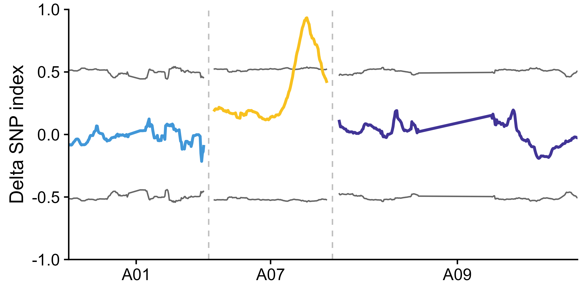
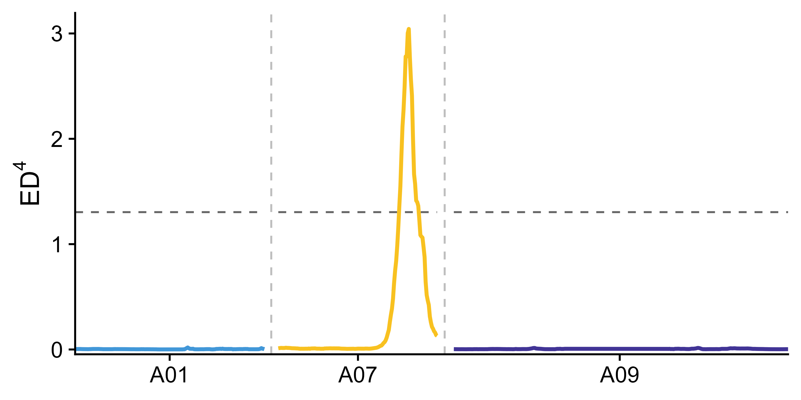
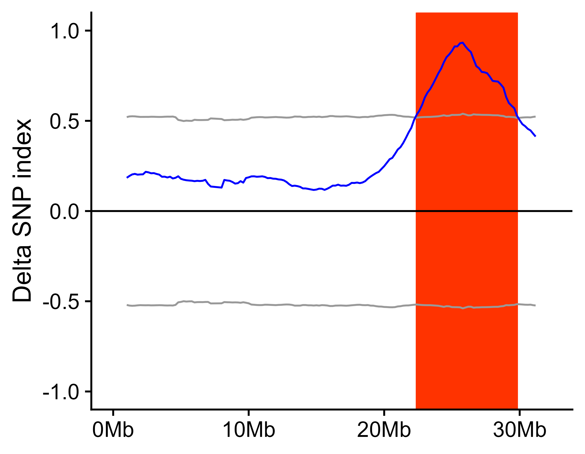
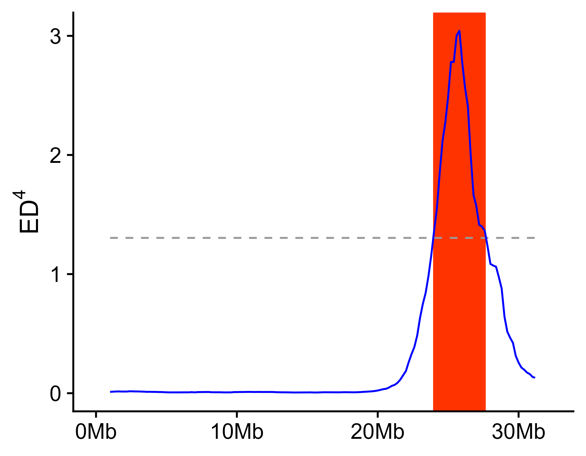

[ [English](./README.md) | [简体中文](https://laowang2023.cn/2023/11/07/20231107-easyQTLseq/) ]

# easyQTLseq: A R Package for QTLseq Analysis
EasyQTLseq is a R package for QTL-seq analysis.

# Installation
EasyQTLseq can be installed from GitHub via devtools:
```{r, eval = FALSE}
# install devtools
install.packages("devtools")
# install easyQTLseq
devtools::install_github("laowang1992/easyQTLseq")
```

# Input Data
## Use GATK VariantsToTable
The VCF file contained parent(s) and two bulks was generated from GATK best practices pipeline. Utilizing VariantsToTable function of GATK to extract GT, AD and GQ information for improving reading and processing speed.
```{shell}
java -Xmx30g -jar ${GATK} \
     -R ${genome} -T VariantsToTable \
     -F CHROM -F POS -F REF -F ALT -GF GT -GF AD -GF GQ \
     -V ${BSA}.filter.SNPs.vcf.gz -o ${BSA}.filter.SNPs.table
```
## Use vcf2table
If you only have a vcf file, and you don't install GATK on your computer. Then you can read the vcf file using `vcfR` package, and use `vcf2table()` function in `easyQTLseq` to convert the vcf object to a table, which is similar the output of GATK's `VariantsToTable`. The output of vcf2table can be used for `select_sample_and_SNP()` directly.
```{r, eval = FALSE}
library(vcfR)
library(easyQTLseq)
file_path <- system.file("extdata", "A07.SNPs.vcf.gz", package = "easyQTLseq")
x <- read.vcfR(file = file_path)
data <- vcf2table(x = x)
```

# Usage
## Library and import data
A sample file is included with this package. There are four samples in this sample file, **R3** is the high phenotype parent sample, **qY** is the low phenotype parent sample, **R** is the high phenotype bulk sample, and **Y** is the low phenotype bulk sample.
```{r}
library(easyQTLseq)
# Example with sample data from a GATK table.
file_path <- system.file("extdata", "subset.table.gz", package = "easyQTLseq")
# readr::read_tsv() has a faster speed than read.table() when reading a file.
data <- readr::read_tsv(file = file_path)
```

## Select samples and SNPs
Some basic information should be assigned use `select_sample_and_SNP()`. This function will return a QTLseq S3 object.
```{r}
x <- select_sample_and_SNP(data = data, highP = "qY", lowP = "R3", highB = "Y", lowB = "R", popType = "F2", bulkSize = c(30, 30))
x
```
This function can handle different situation, such as both parents of the segregation population are present, only high parent or low parent is present, and no parent is present, or one of these present has a reference genome used for SNP calling. 
```{r, eval = FALSE}
# If only one parent is present, e.g. high parent.
x_onlyHP <- select_sample_and_SNP(data = data, highP = "qY", highB = "Y", lowB = "R", popType = "F2", bulkSize = c(30, 30))
# If no parent is present.
x_noParent <- select_sample_and_SNP(data = data, highB = "Y", lowB = "R", popType = "F2", bulkSize = c(30, 30))
# If no parent is present, but high parent has a reference genome, this reference genome is used for SNP calling. Then the `highP` parameter should be "REF".
x_HPisREF <- select_sample_and_SNP(data = data, highP = "REF", highB = "Y", lowB = "R", popType = "F2", bulkSize = c(30, 30))
```

## Depth statistics
After select samples and SNPs, the coverage depth distribution of every samples is calculated, then a density distribution figure is drawn, named `<outPrefix>.depth_density.pdf|png`
```{r, eval = FALSE}
depth_statistics(x = x, outPrefix = "outprefix")
```
```{r, fig.cap="outprefix.depth_density.png", fig.align='center', out.width="100%", echo = FALSE}
knitr::include_graphics("./docs/outprefix.depth_density.png")
```

## Filter SNP according depth distribution
For low coverage depth SNP may have low reliability and accuracy, and extremely high coverage depth may be derived from repetitive sequence. These SNP should be omited. 
```{r, eval = FALSE}
# default minimum coverage depth is 6, default maximum coverage depth is `average+3*sd`.
x_filter <- filterDP(x = x)
```

## SNP distribution
SNPs may be unevenly distributed on chromosomes. This step will show the distribution of SNP along the chromosome and generate `<outprefix>.SNP_number_per_chr.txt|csv` and `<outprefix>.SNP_distribution_histogram.pdf|png`.
```{r, eval = FALSE}
SNP_distribution(x = x_filter, outPrefix = "outprefix", 
                 targetChr = c("scaffoldA01", "scaffoldA07", "scaffoldA09"), 
                 chrLabel = c("A01", "A07", "A09"))
```
```{r, fig.cap="outprefix.SNP_distribution_histogram.png", fig.align='center', out.width="80%", echo = FALSE}

```

## Export depth coverage information
If you want analyze QTL-seq using other method or software, you can export allele depths information using `export_dp()`. This information will be export to `<outprefix>.Depth_information.txt|csv` in work directory.
```{r, eval = FALSE}
export_dp(x = x_filter, outPrefix = "outprefix")
```

## Calculate using sliding window
To reduce noise in QTL-seq analsis, a sliding window method is adopted to calculate SNP index, delta SNP index, and Euclidean distance (ED). 

If parent is present in the data or parent has a reference genome which is used for SNP calling, both delta SNP index and DE are calculated, if no parent is present in the data, only ED is calculated.
```{r, eval = FALSE}
x_filter <- calc_index_etc(x = x_filter, outPrefix = "outprefix", winSize = 2000000, winStep = 200000)
```

## Export figures
After calculating delta SNP index and DE, the result can be show along the chromosome. This function will export the figures.
```{r, eval = FALSE}

export_figure(x = x_filter, 
              outPrefix = "outprefix", 
              targetChr = c("scaffoldA01", "scaffoldA07", "scaffoldA09"), # Target chromosome to be drawn in figures, default is all chromosomes in the data.
              chrLabel = c("A01", "A07", "A09"),                          # The label for chromosome shown in figures, default is chromosome names in the data.
              minN = 20,                                                  # Too few SNPs in a window will result in noise, the windows containing SNPs less than minN will be omitted in figures.
              width = 6, height = 3)
```

```{r, fig.cap="outprefix.delta_SNP_index.99CI.line.png", fig.align='center', out.width="80%", echo = FALSE}

```

```{r, fig.cap="outprefix.ED4.line.png", fig.align='center', out.width="80%", echo = FALSE}

```

## Get significant QTL region
If parent is present in the data or parent has a reference genome which is used for SNP calling, delta SNP index confidence intervals for different read depths under the null hypothesis (no QTL) as obtained by simulation test (10,000 replications for each read depth). The chromosome regions exceed 95% or 99% confidence intervals are considered as significant QTL region.
```{r, eval = FALSE}
getQTL_and_exportFigure(x = x_filter, outPrefix = "outprefix", minN = 20)
```
```{r, fig.cap="outprefix.scaffoldA07.99CI.png", fig.align='center', out.width="50%", echo = FALSE}

```
```{r, fig.cap="outprefix.scaffoldA07.ED4.png", fig.align='center', out.width="50%", echo = FALSE}

```

# Citation
If this package is used in your research, you should cite this package in the method section, like:

> The QTL-seq analysis was performed using R package easyQTLseq (https://github.com/laowang1992/easyQTLseq.git). 

This paper is also recommended to cite:

> [Takagi H, Abe A, Yoshida K, et al. QTL-seq: rapid mapping of quantitative trait loci in rice by whole genome resequencing of DNA from two bulked populations. Plant J. 2013;74(1):174-183. doi:10.1111/tpj.12105](https://onlinelibrary.wiley.com/doi/10.1111/tpj.12105)
