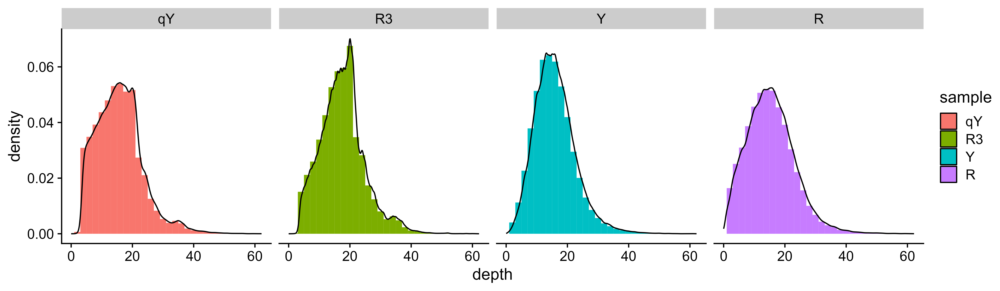
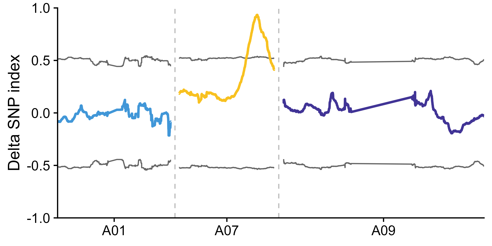
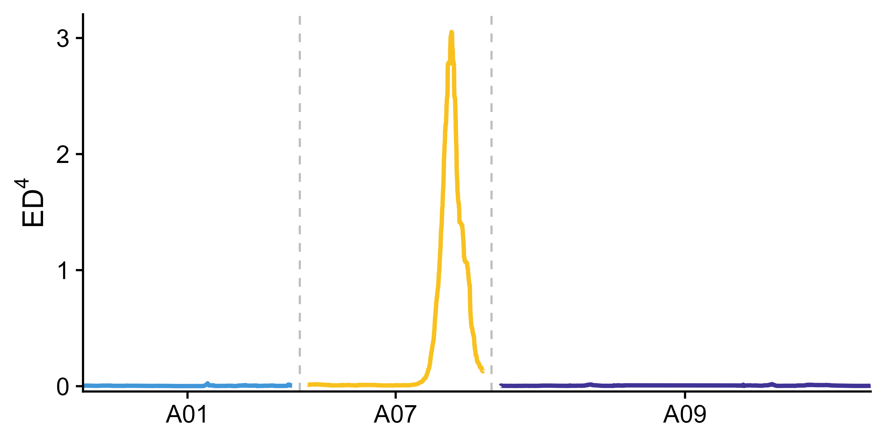
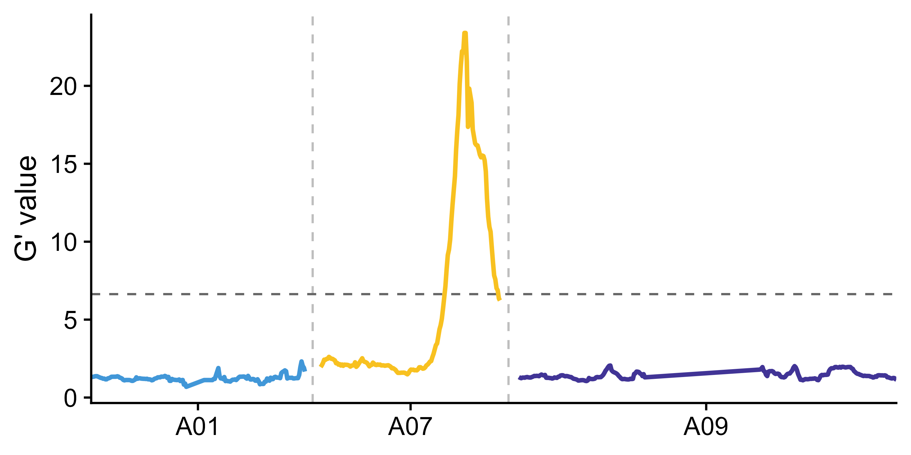
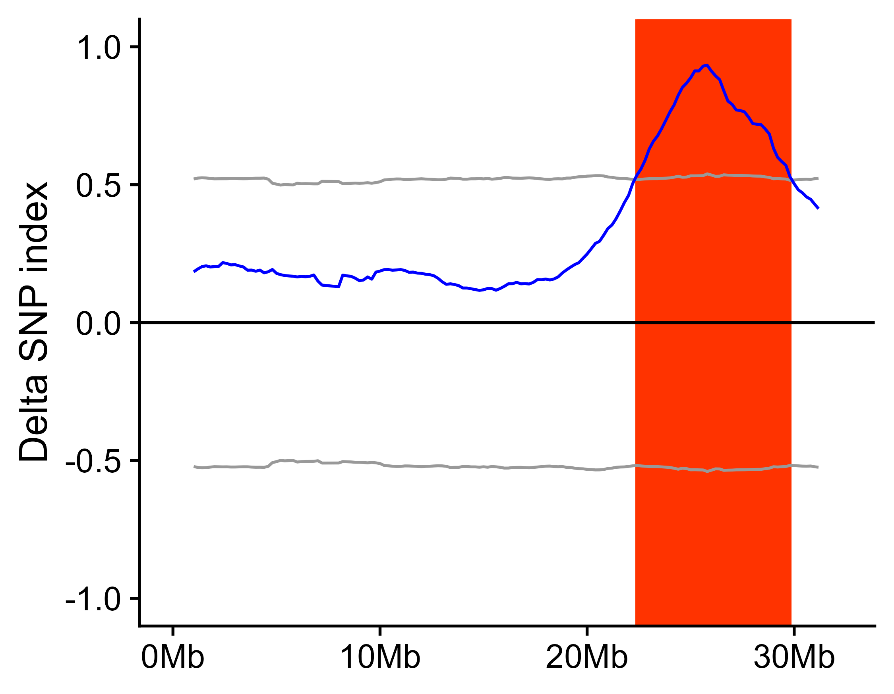
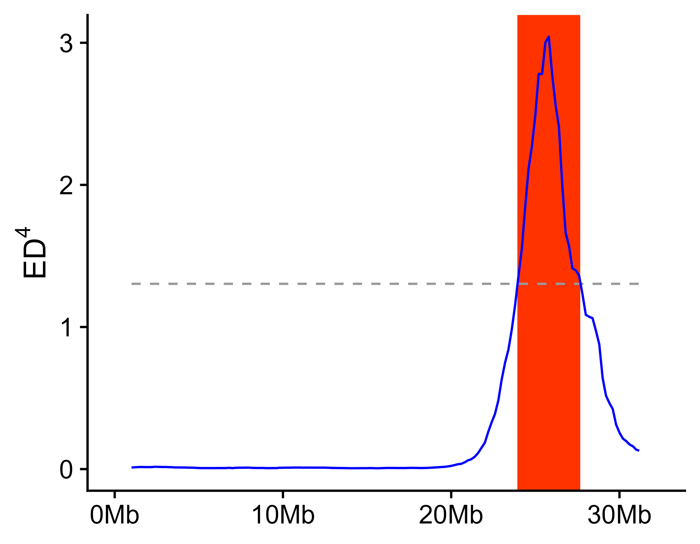
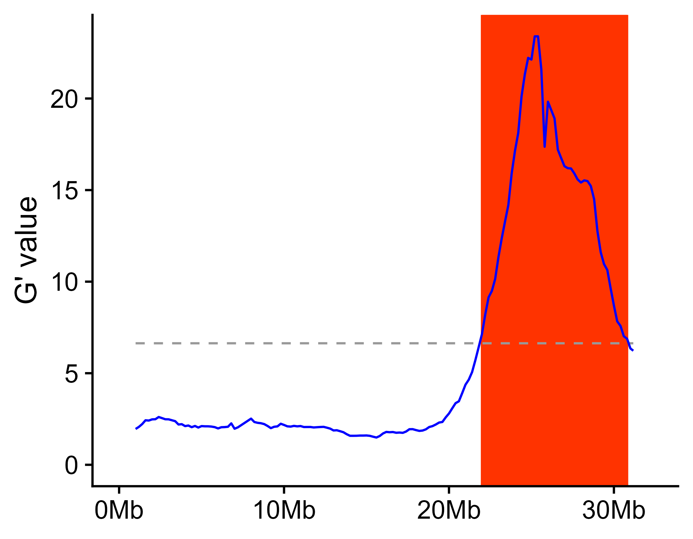

\[ [English](./README.md) \|
[简体中文](https://laowang2023.cn/2023/11/07/20231107-easyQTLseq/) \]

# easyQTLseq: A R Package for QTLseq Analysis

EasyQTLseq is a R package for QTL-seq analysis.

# Installation

EasyQTLseq can be installed from GitHub via devtools:

``` r
# install devtools
install.packages("devtools")
# install easyQTLseq
devtools::install_github("laowang1992/easyQTLseq")
```

# Input Data

## Use GATK VariantsToTable

The VCF file contained parent(s) and two bulks was generated from GATK
best practices pipeline. Utilizing VariantsToTable function of GATK to
extract GT, AD and GQ information for improving reading and processing
speed.

``` shell
java -Xmx30g -jar ${GATK} \
     -R ${genome} -T VariantsToTable \
     -F CHROM -F POS -F REF -F ALT -GF GT -GF AD -GF GQ \
     -V ${BSA}.filter.SNPs.vcf.gz -o ${BSA}.filter.SNPs.table
```

## Use vcf2table

If you only have a vcf file, and you don’t install GATK on your
computer. Then you can read the vcf file using `vcfR` package, and use
`vcf2table()` function in `easyQTLseq` to convert the vcf object to a
table, which is similar the output of GATK’s `VariantsToTable`. The
output of vcf2table can be used for `select_sample_and_SNP()` directly.

``` r
library(vcfR)
library(easyQTLseq)
file_path <- system.file("extdata", "A07.SNPs.vcf.gz", package = "easyQTLseq")
x <- read.vcfR(file = file_path)
data <- vcf2table(x = x)
```

# Usage

## Library and import data

A sample file is included with this package. There are four samples in
this sample file, **R3** is the high phenotype parent sample, **qY** is
the low phenotype parent sample, **R** is the high phenotype bulk
sample, and **Y** is the low phenotype bulk sample.

``` r
library(easyQTLseq)
# Example with sample data from a GATK table.
file_path <- system.file("extdata", "subset.table.gz", package = "easyQTLseq")
# readr::read_tsv() has a faster speed than read.table() when reading a file.
data <- readr::read_tsv(file = file_path)
```

    ## Rows: 515669 Columns: 16
    ## ── Column specification ────────────────────────────────────────────────────────
    ## Delimiter: "\t"
    ## chr (11): CHROM, REF, ALT, R.GT, R.AD, R3.GT, R3.AD, Y.GT, Y.AD, qY.GT, qY.AD
    ## dbl  (5): POS, R.GQ, R3.GQ, Y.GQ, qY.GQ
    ## 
    ## ℹ Use `spec()` to retrieve the full column specification for this data.
    ## ℹ Specify the column types or set `show_col_types = FALSE` to quiet this message.

## Select samples and SNPs

Some basic information should be assigned use `select_sample_and_SNP()`.
This function will return a QTLseq S3 object.

``` r
x <- select_sample_and_SNP(data = data, highP = "qY", lowP = "R3", highB = "Y", lowB = "R", popType = "F2", bulkSize = c(30, 30))
x
```

    ## $data
    ## # A tibble: 128,751 × 12
    ##    CHROM          POS REF   ALT   HP.DP LP.DP HB.HP.AD HB.LP.AD HB.DP LB.HP.AD
    ##    <chr>        <dbl> <chr> <chr> <int> <int>    <int>    <int> <int>    <int>
    ##  1 scaffoldA01 275959 A     C        17    24        6        6    12       16
    ##  2 scaffoldA01 320766 G     A        19    11        6        6    12       10
    ##  3 scaffoldA01 361230 A     T        18     6        6        5    11        8
    ##  4 scaffoldA01 361486 G     T        26     9       13        5    18        8
    ##  5 scaffoldA01 361875 A     C        19     5        8        0     8        4
    ##  6 scaffoldA01 361884 T     G        19     5        8        0     8        6
    ##  7 scaffoldA01 362128 A     C        19     6        7        5    12        4
    ##  8 scaffoldA01 362153 T     G        20     5        8        5    13        6
    ##  9 scaffoldA01 364170 C     T        17    14       12        9    21       14
    ## 10 scaffoldA01 365454 T     C        18    10       11        5    16       15
    ## # ℹ 128,741 more rows
    ## # ℹ 2 more variables: LB.LP.AD <int>, LB.DP <int>
    ## 
    ## $highP
    ## [1] "qY"
    ## 
    ## $lowP
    ## [1] "R3"
    ## 
    ## $highB
    ## [1] "Y"
    ## 
    ## $lowB
    ## [1] "R"
    ## 
    ## $popType
    ## [1] "F2"
    ## 
    ## $bulkSize
    ## [1] 30 30
    ## 
    ## $slidwin
    ## data frame with 0 columns and 0 rows
    ## 
    ## $chrLen
    ## # A tibble: 3 × 2
    ##   CHROM            Len
    ##   <chr>          <dbl>
    ## 1 scaffoldA01 37932493
    ## 2 scaffoldA07 32276921
    ## 3 scaffoldA09 65861795
    ## 
    ## attr(,"class")
    ## [1] "QTLseq"     "WithParent" "BothParent"

This function can handle different situation, such as both parents of
the segregation population are present, only high parent or low parent
is present, and no parent is present, or one of these present has a
reference genome used for SNP calling.

``` r
# If only one parent is present, e.g. high parent.
x_onlyHP <- select_sample_and_SNP(data = data, highP = "qY", highB = "Y", lowB = "R", popType = "F2", bulkSize = c(30, 30))
# If no parent is present.
x_noParent <- select_sample_and_SNP(data = data, highB = "Y", lowB = "R", popType = "F2", bulkSize = c(30, 30))
# If no parent is present, but high parent has a reference genome, this reference genome is used for SNP calling. Then the `highP` parameter should be "REF".
x_HPisREF <- select_sample_and_SNP(data = data, highP = "REF", highB = "Y", lowB = "R", popType = "F2", bulkSize = c(30, 30))
```

## Depth statistics

After select samples and SNPs, the coverage depth distribution of every
samples is calculated, then a density distribution figure is drawn,
named `<outPrefix>.depth_density.pdf|png`

``` r
depth_statistics(x = x, outPrefix = "outprefix")
```

<div class="figure" style="text-align: center">


<p class="caption">
outprefix.depth_density.png
</p>

</div>

## Filter SNP according depth distribution

For low coverage depth SNP may have low reliability and accuracy, and
extremely high coverage depth may be derived from repetitive sequence.
These SNP should be omited.

``` r
# default minimum coverage depth is 6, default maximum coverage depth is `average+3*sd`.
x_filter <- filterDP(x = x)
```

## SNP distribution

SNPs may be unevenly distributed on chromosomes. This step will show the
distribution of SNP along the chromosome and generate
`<outprefix>.SNP_number_per_chr.txt|csv` and
`<outprefix>.SNP_distribution_histogram.pdf|png`.

``` r
SNP_distribution(x = x_filter, outPrefix = "outprefix", 
                 targetChr = c("scaffoldA01", "scaffoldA07", "scaffoldA09"), 
                 chrLabel = c("A01", "A07", "A09"))
```

<div class="figure" style="text-align: center">


<p class="caption">
outprefix.SNP_distribution_histogram.png
</p>

</div>

## Export depth coverage information

If you want analyze QTL-seq using other method or software, you can
export allele depths information using `export_dp()`. This information
will be export to `<outprefix>.Depth_information.txt|csv` in work
directory.

``` r
export_dp(x = x_filter, outPrefix = "outprefix")
```

## Calculate using sliding window

To reduce noise in QTL-seq analsis, a sliding window method is adopted
to calculate SNP index, delta SNP index, Euclidean distance (ED) and G
value.

If parent is present in the data or parent has a reference genome which
is used for SNP calling, delta SNP index, DE and G value are calculated,
if no parent is present in the data, only ED and G value are calculated.

``` r
x_filter <- calc_index_etc(x = x_filter, outPrefix = "outprefix", winSize = 2000000, winStep = 200000)
```

- for SNP index:

  ``` math
  \Delta \mathrm{SNP\ Index} = \mathrm{SNP\ Index}_{\text{Pool1}} - \mathrm{SNP\ Index}_{\text{Pool2}}
  ```

  ``` math
  \mathrm{SNP\ Index} = \frac{\text{Alt Depth}}{\text{Total Depth}}
  ```

- for Euclidean distance:

  ``` math
  ED=\sqrt{(A_{mut}-A_{wt})^2+(C_{mut}-C_{wt})^2+(G_{mut}-G_{wt})^2+(T_{mut}-T_{wt})^2}
  ```

- for G value:

  |            | Ref allele | Alt allele | Total             |
  |------------|------------|------------|-------------------|
  | **Pool A** | A₁         | A₂         | A₁ + A₂           |
  | **Pool B** | B₁         | B₂         | B₁ + B₂           |
  | **Total**  | A₁ + B₁    | A₂ + B₂    | A₁ + A₂ + B₁ + B₂ |

  ``` math
  G = 2 \left[
  A_1 \ln \left( \frac{A_1}{E_{A_1}} \right) +
  A_2 \ln \left( \frac{A_2}{E_{A_2}} \right) +
  B_1 \ln \left( \frac{B_1}{E_{B_1}} \right) +
  B_2 \ln \left( \frac{B_2}{E_{B_2}} \right)
  \right]
  ```

  ``` math
  \begin{aligned}
  E_{A_1} &= \frac{(A_1 + B_1) \times (A_1 + A_2)}{A_1 + A_2 + B_1 + B_2} \\
  E_{A_2} &= \frac{(A_2 + B_2) \times (A_1 + A_2)}{A_1 + A_2 + B_1 + B_2} \\
  E_{B_1} &= \frac{(A_1 + B_1) \times (B_1 + B_2)}{A_1 + A_2 + B_1 + B_2} \\
  E_{B_2} &= \frac{(A_2 + B_2) \times (B_1 + B_2)}{A_1 + A_2 + B_1 + B_2} \\
  \end{aligned}
  ```

## Export figures

After calculating delta SNP index, DE and G value, the result can be
show along the chromosome. This function will export the figures.

``` r
export_figure(x = x_filter, 
              outPrefix = "outprefix", 
              targetChr = c("scaffoldA01", "scaffoldA07", "scaffoldA09"), # Target chromosome to be drawn in figures, default is all chromosomes in the data.
              chrLabel = c("A01", "A07", "A09"),                          # The label for chromosome shown in figures, default is chromosome names in the data.
              minN = 20,                                                  # Too few SNPs in a window will result in noise, the windows containing SNPs less than minN will be omitted in figures.
              width = 6, height = 3)
```

<div class="figure" style="text-align: center">


<p class="caption">
outprefix.delta_SNP_index.99CI.line.png
</p>

</div>

<div class="figure" style="text-align: center">


<p class="caption">
outprefix.ED4.line.png
</p>

</div>

<div class="figure" style="text-align: center">


<p class="caption">
outprefix.Gprime.line.png
</p>

</div>

## Get significant QTL region

If parent is present in the data or parent has a reference genome which
is used for SNP calling, delta SNP index confidence intervals for
different read depths under the null hypothesis (no QTL) as obtained by
simulation test (10,000 replications for each read depth). The
chromosome regions exceed 95% or 99% confidence intervals are considered
as significant QTL region.

``` math
\text{QTL region} = \left\{ x \;\middle|\; \left| \Delta \text{SNP-index}(x) \right| > \mathrm{CI}_{\alpha}(x) \right\}
```

As for euclidean distance (ED) algorithm, the chromosome regions where
the fourth power of the Euclidean distance exceeds the mean plus three
times the variance of the fourth power of the Euclidean distance are
considered QTL regions.

``` math
\text{QTL region} = \left\{ x \,\big|\, \mathrm{ED}^4(x) > \overline{\mathrm{ED}^4} + 3 \cdot \mathrm{Var}(\mathrm{ED}^4) \right\}
```

As for G’ value, the significance threshold under the null hypothesis
(no QTL) is determined at *p* \< 0.01, chromosome regions exceeding this
threshold are considered as significant QTL regions.

``` math
\text{QTL region} = \left\{ x \,\big|\, G'(x) > G'_{0.01} \right\}
```

``` r
getQTL_and_exportFigure(x = x_filter, outPrefix = "outprefix", minN = 20)
```

<div class="figure" style="text-align: center">


<p class="caption">
outprefix.scaffoldA07.99CI.png
</p>

</div>

<div class="figure" style="text-align: center">


<p class="caption">
outprefix.scaffoldA07.ED4.png
</p>

</div>

<div class="figure" style="text-align: center">


<p class="caption">
outprefix.scaffoldA07.Gprime.png
</p>

</div>

# Citation

If this package is used in your research, you should cite this package
in the method section, like:

> The QTL-seq analysis was performed using R package easyQTLseq
> (<https://github.com/laowang1992/easyQTLseq.git>).

This paper is also recommended to cite:

> [Takagi H, Abe A, Yoshida K, et al. QTL-seq: rapid mapping of
> quantitative trait loci in rice by whole genome resequencing of DNA
> from two bulked populations. Plant J. 2013;74(1):174-183.
> doi:10.1111/tpj.12105](https://onlinelibrary.wiley.com/doi/10.1111/tpj.12105)
